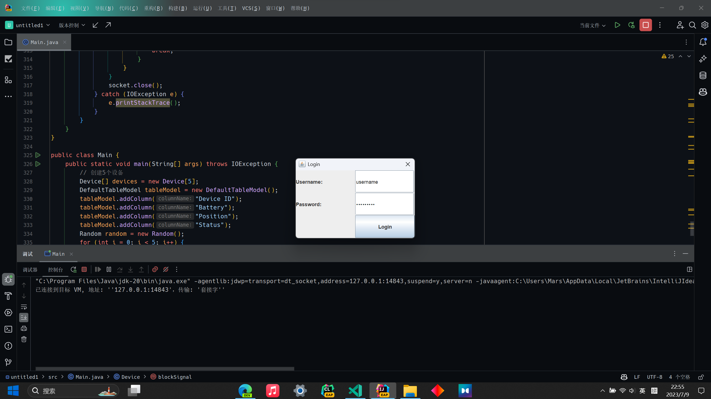
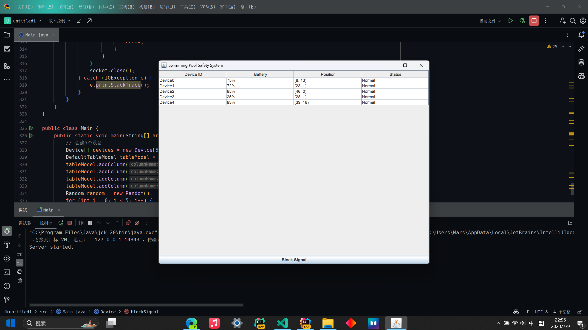

# 游泳馆救生系统报告

## 1. 项目要求
系统分为头戴式感应设备、服务器两部分，服务器实时接收设备的位置信息，并根据设备返回信号的时间间隔判断是否溺水，并在发生溺水时发出声音、颜色等警报。利用面向对象设计方法设计以上系统，包含以下功能：  
1) 设计一个设备类，包含id、电量百分比、设备状态、位置坐标x、位置坐标y、上一次有信号的时间、与上一次有信号的时间间隔（单位秒）等属性，并有判断是否溺水（设备每2秒向服务器发送一次位置信号（位置信号采用随机数模拟，x为0-50，y为0-21），如果超过10秒没有信号，则警告（黄色），超过30秒没有信号，报警（红色且有声音））方法IsDrown()；  
2) 系统包含一个报警接口，接口内包含声音播放方法，可以播放音频文件； 
3) 系统至少包含5个设备，设备与服务器之间采用TCP/IP协议通信，协议格式（id 当前时间 电量百分比 位置x 位置y）使用Socket编程实现； 
4) 服务器端包含图形界面，具有用户登录、设备id显示、电量显示、位置坐标显示、状态显示等功能；  
5) 用户登录过程中，校对用户名和密码，密码要求至少一个大写字母，一个小写字母和一个数字，且最短长度为八位；状态显示分为四种，正常、警告、报警、电量低（电量小于10%），前三种状态判断规则如1）所述，电量低状态在电量小于10%时显示；

## 2. 设计思路与具体实现
### 2.1 报警接口
报警接口包含声音播放方法，可以播放音频文件。  
具体实现：直接使用了课程作业中播放MP3的代码，将其封装成一个接口，调用其playWarning方法即可播放音频文件。
### 2.2 设备类
设备类调用Runnable接口，实现多线程。每个设备都是一个线程，每隔2秒向服务器发送一次位置信号，位置信号采用随机数模拟，x为0-50，y为0-21。如果超过10秒没有信号，则警告（黄色），超过30秒没有信号，报警（红色且有声音）。
设备类同时调用了报警接口，当设备发生溺水时，调用报警接口的playWarning方法，播放音频文件。
#### 2.2.1 设备类的属性
设备类的属性包括：id、电量百分比、设备状态、位置坐标x、位置坐标y、上一次有信号的时间、与上一次有信号的时间间隔（单位秒）等属性。
#### 2.2.2 设备类的方法
设备类的方法包括：run方法，isDrown方法，updateSignal方法，updateTable方法和blockSignal方法，具体提方法的实现如下：
1) run方法：run方法是设备类的主方法updateSignal方法，用于实现设备的启动
2) isDrown方法：isDrown方法用于判断设备是否发生溺水
3) nupdateSignal方法：updateSignal方法用于更新设备的位置信号，同时对设备的状态进行判断，如果设备发生溺水，则调用报警接口的playWarning方法，播放音频文件，同时调用updateTable方法，更新服务器端的表格
4) updateTable方法：updateTable方法用于更新服务器端的表格
5) blockSignal方法：blockSignal方法用于阻塞设备的位置信号，用于模拟设备发生溺水的情况，测试警报功能是否正常
### 2.3 服务器端
服务器端包含图形界面，具有用户登录、设备id显示、电量显示、位置坐标显示、状态显示等功能。同时设备与服务器之间采用TCP/IP协议通信，协议格式（id 当前时间 电量百分比 位置x 位置y）使用Socket编程实现； 
#### 2.3.1 服务器端的属性
服务器端的属性包括：设备id、电量、位置坐标、状态等属性
#### 2.3.2 服务器端的方法
服务器端的方法包括：login方法，displyDevices方法和startServer方法，具体提方法的实现如下：
1) login方法：login方法用于实现用户登录，校对用户名和密码，密码要求至少一个大写字母，一个小写字母和一个数字，且最短长度为八位
2) displayDEvices方法：该方法中包含了该系统的所有图形界面功能，包括：
    1) 显示登陆界面，登陆界面包括用户名和密码的输入框，以及登陆按钮
    2) 显示一个包含设备id、电量、位置坐标、状态等属性的表格
    3) 显示一个按钮，用于阻塞设备的位置信号，用于模拟设备发生溺水的情况，测试警报功能是否正常
3) startServer方法：startServer方法用于启动服务器端，接收设备的位置信息，并根据设备返回信号的时间间隔判断是否溺水，并在发生溺水时发出声音、颜色等警报
### 2.4 客户端
客户端用于实现设备与服务器之间的通信，设备与服务器之间采用TCP/IP协议通信，协议格式（id 当前时间 电量百分比 位置x 位置y）使用Socket编程实现；
### 2.5 测试
测试的主函数首先创建5个设备，然后创建一个服务器端，最后启动服务器端，测试结果如下：
登录：

设备界面：

## 3. 实现过程中遇到的问题及解决方法：
1. 问题：在实现设备类的时候，由于设备类需要调用报警接口，而报警接口需要调用设备类，导致了循环调用的问题，最终导致了栈溢出的错误。
   解决方法：将报警接口的方法封装成一个接口，调用其playWarning方法即可播放音频文件。
2. 在实现登录窗口时无法使登录密码不可见，最终通过设置密码框的属性实现了该功能。
3. 在实现设备的电量，位置，状态等数据的实施更新时遇到了很大的困难，最终通过查阅网上资料解决了该问题。
4. 实现了系统的基本功能之后，无法确认系统是否可以在多线程的情况下正常运行，最终通过测试证明了系统的正常运行。
5. 系统基本完成后，无法确认系统是否i可以在信号丢失的情况下发出警报，通过设计一个阻塞信号的按钮，模拟设备发生溺水的情况，测试警报功能是否正常。

### 4.过程中使用的第三方代码和库
1. 课程作业中播放MP3的代码和第三方库
2. 课程作业中的Socket编程代码
3. 课程作业中的GUI代码
4. 课程作业中的多线程代码

### 5. 项目总结和收获
虽然在大一上学期的c语言课程中已经单独完成了一个简单的图书管理系统的实现，但是这次的项目确实难度和复杂程度远远超过之前的额任务，这次的项目是一个完整的系统，需要实现的功能也非常多，包括多线程，Socket编程，GUI编程等，虽然最终在查阅了许多资料的情况下只能说是“初步的”完成了这个项目，其实还有许多想法和想要完善的地方，但实在是碍于时间和个人能力，无法一一实现。  
在这次实现系统的过程中，我深深体会到了书到用时方恨少的无奈，也感受到了一个个功能得到实现时的欣喜  
最后非常感谢徐老师这一个学期的教导，谢谢您！

## P.S. 项目的代码已提交在GitHub上，地址为：https://github.com/liaboveall/swimSystem
### 人生第一个GitHub项目，希望老师能够看到，谢谢！